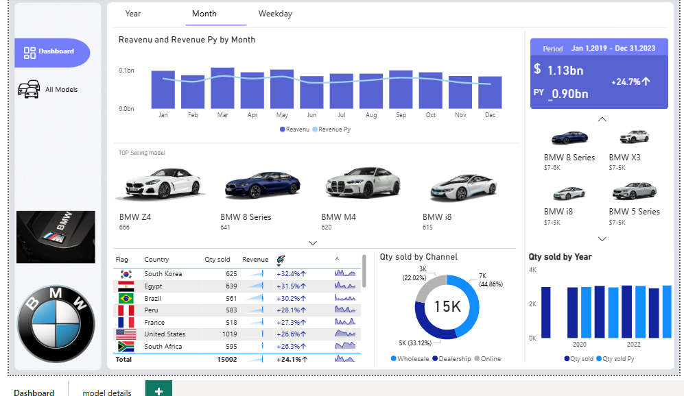
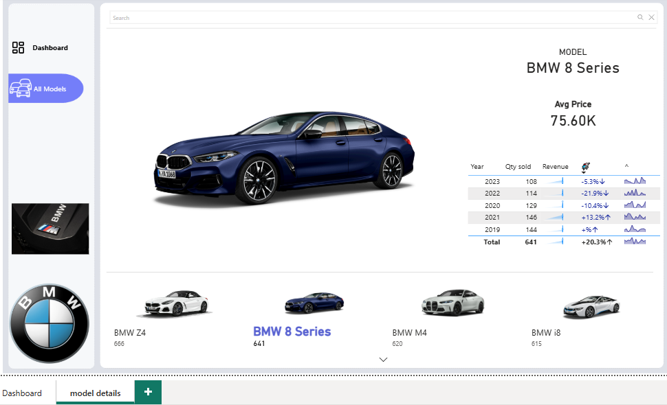
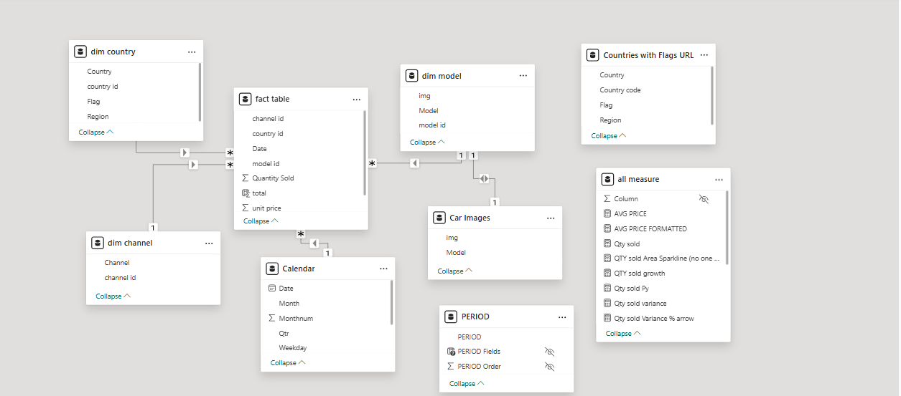

# 🚗 BMW Global Sales Analysis | Power BI Suite

<p align="center">
  
  
  
  
</p>

## 📌 Table of Contents
- [Project Overview](#-project-overview)
- [Data Architecture](#-data-architecture)
- [Multi-Page Insights](#-multi-page-insights)
- [Key Findings](#-key-findings)
- [Visual Gallery](#-visual-gallery)
- [Technical Skills](#-technical-skills-demonstrated)
- [Setup Instructions](#-how-to-use)
- [Contact](#-contact-information)

---

## 🎯 Project Overview
An advanced **BMW Sales Intelligence Dashboard** analyzing a global dataset of **15,002 units** sold between **2019 and 2023**. This project evaluates performance across **26 models**, **23 countries**, and **3 sales channels**, providing a data-driven narrative on revenue trends, regional dominance, and the growing footprint of electric vehicles (EVs).

## 🏗️ Data Architecture
The dashboard is built on a high-performance **Star Schema** to handle complex multi-dimensional analysis:
* **Fact Table:** `BMW_Sales_Data` (5,000 transactions).
* **Dimensions:** `dim model`, `dim channel`, `Calendar`, `Countries with Flags`, and `Car Images`.
* **Integration:** Merged sales data with external stock prices and visual assets for a rich UI/UX experience.

---

## 💡 Key Findings

### 💰 Financial Performance
* **Total Revenue:** **$376.1M** with an average transaction value of **$75.2K**.
* **Top Revenue Generator:** The **BMW Z4** leads with **$17.1M**, followed closely by the **3 Series** ($16.2M).
* **Channel Strategy:** **Wholesale** remains the primary driver (44.1%), while **Online sales** show significant digital adoption at 22.4%.

### 🌍 Regional & Market Insights
* **Top Region:** **Africa** leads global revenue at **$82.3M (21.9%)**, followed by South America (20.0%).
* **Market Leaders:** **Mexico** and the **USA** are the top-performing countries, each contributing over **$25M**.
* **Emerging Markets:** Strong performance in Nigeria, Kenya, and Egypt highlights BMW’s growing presence in the MENA and African regions.

### 🔋 Product Portfolio Trends
* **EV Adoption:** The **BMW iX** and **i3** are leading the electric transition with combined revenues exceeding **$29M**.
* **SUV Dominance:** The **X-Series** continues to show robust sales across all global markets.

---

## 📸 Visual Gallery

### 1. Executive Summary
*Overview of core KPIs, regional distribution, and top-tier model performance.*


### 2. Model Deep-Dive
*Granular analysis of individual models (e.g., 8 Series) featuring price trends and quarterly growth.*


### 3. The Engine (Data Modeling)
*A look at the relational schema and optimized table connections.*


---

## 🛠️ Technical Skills Demonstrated
* **Multi-Page Dashboarding:** Designed a seamless navigation flow between high-level summaries and granular details.
* **Advanced DAX:** Measures for `YOY Growth`, `QTY Variance %`, and `Dynamic Sparklines`.
* **Geospatial Analytics:** Tracking performance across 5 continents and 23 countries.
* **Visual Storytelling:** Incorporating country flags and car images for an intuitive, brand-aligned interface.

---

## 🚀 How to Use
1.  **Clone the Repo:**
    ```bash
    git clone [https://github.com/eslamrezk14/BMW-Sales-Analysis.git](https://github.com/eslamrezk14/BMW-Sales-Analysis.git)
    ```
2.  **Prerequisites:** Install [Power BI Desktop](https://powerbi.microsoft.com/desktop/).
3.  **Data Connection:** Open the `.pbix` file. The dashboard is pre-linked to the CSV files in the root directory.
4.  **Explore:** Use the slicers to filter by **Region**, **Year (2019-2023)**, or **Sales Channel**.

## 📂 Project Structure
```text
BMW-Sales-Analysis/
├── BMW-Sales-Dashboard.pbix   # Main Report
├── README.md                  # Documentation
├── data/                      # CSV Data Sources (Sales, Stocks, Flags)
└── images/                    # Visual Screenshots
    ├── Dashboard-1.png
    ├── Model-details.png
    └── Data-modilling.png
